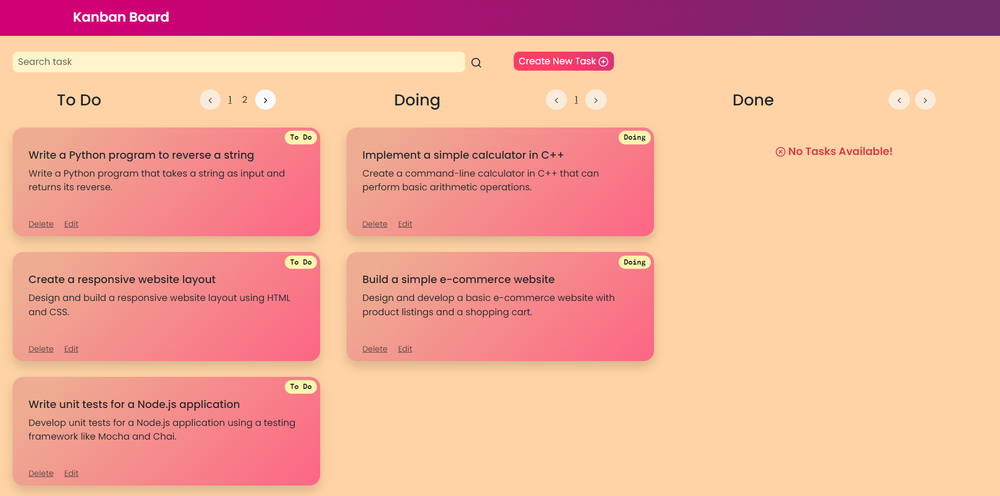

# Kanban Board Task Management

Live URL: https://kanban-board-management.netlify.app/

API Documentation: https://documenter.getpostman.com/view/28816987/2s9Y5cuLge
## Table of Contents

- [Introduction](#introduction)
- [Features](#features)
- [Technologies](#technologies)
- [Prerequisites](#prerequisites)
- [Installation](#installation)
- [Setup](#setup)
- [Usage](#usage)
- [API Documentation](#api-documentation)
- [Acknowledgments](#acknowledgments)

## Introduction

A Kanban Board Task Management application built with React, designed to help you manage your tasks efficiently using a Kanban-style board.



## Features

- **Kanban Board**: Organize tasks into columns such as "To Do," "Doing," and "Done" for easy visualization of your workflow.
- **Drag-and-Drop**: Easily move tasks between columns using intuitive drag-and-drop functionality.
- **Search**: Quickly find tasks using the search feature.
- **Task Creation**: Create new tasks with titles, descriptions, and categories.
- **Task Update**: Edit task details and categories as needed.
- **Task Deletion**: Remove tasks you no longer need.
- **Responsive Design**: Works seamlessly on various screen sizes.

## Technologies

The Kanban Board Task Management is built using the following technologies:

- **Frontend**:

  - React: _JavaScript library for building user interfaces._
  - Context API: _State management library for managing global application state._
  - HTML/CSS: _Markup and styling of the application._
  - Axios: _HTTP client for making API requests._

- **Backend**:
  - Node.js: _JavaScript runtime for server-side development._
  - Express: _Web framework for building APIs._
  - MongoDB: _NoSQL database for storing application data._
  - Mongoose: _MongoDB object modeling for Node.js._
  - JSON Web Tokens (JWT): _For user authentication and authorization._

## Prerequisites

- [Node.js](https://nodejs.org/) installed on your machine.
- [npm](https://www.npmjs.com/) or [Yarn](https://yarnpkg.com/) package manager.

## Installation

1. Clone the repository:

   ```bash
   git clone https://github.com/jacktherock/Kanban-Board-Task-Management.git
   ```

2. Install dependencies:

- For client (frontend)
  ```bash
  cd client
  npm install
  ```
- For server (backend)
  ```bash
  cd server
  npm install
  ```

## Setup

To run the Kanban Board Task Management on your local machine, follow these steps:

1. Set up environment variables:

Create a `.env` file in the `backend` directory and add the following:

```bash
DATABASE=your_mongodb_connection_string
```

Replace `your_mongodb_connection_string` with your actual MongoDB connection string.

2. Start the backend server:

```bash
cd server

npm run dev
```

3. Start the frontend application:

```bash
cd client

npm run dev
```

## Usage

- Open your web browser and go to `http://localhost:5173` to access the application.
- Create tasks by clicking the "Create New Task" button.
- Drag and drop tasks between columns to change their status.
- Use the search bar to find specific tasks by title or description.
- Edit or delete tasks as needed.

## API Documentation

API documentation provides details about the endpoints used to interact with the application's server. This documentation assumes you have set up the application on your local machine or deployed it to a server.

Please refer to the [API Documentation](https://documenter.getpostman.com/view/28816987/2s9Y5cuLge) for a detailed view of the API endpoints, including request parameters, response formats, and example usage.

## Acknowledgments

- Built with [React](https://reactjs.org/) and [Bootstrap](https://getbootstrap.com/).
- Utilizes [react-beautiful-dnd](https://github.com/atlassian/react-beautiful-dnd) for drag-and-drop functionality.

---
